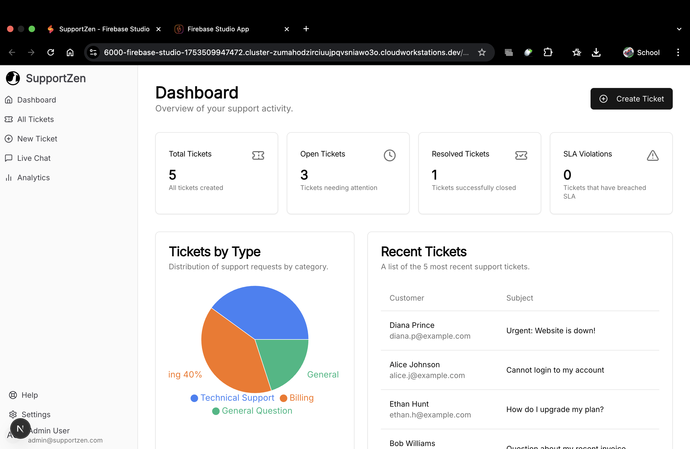
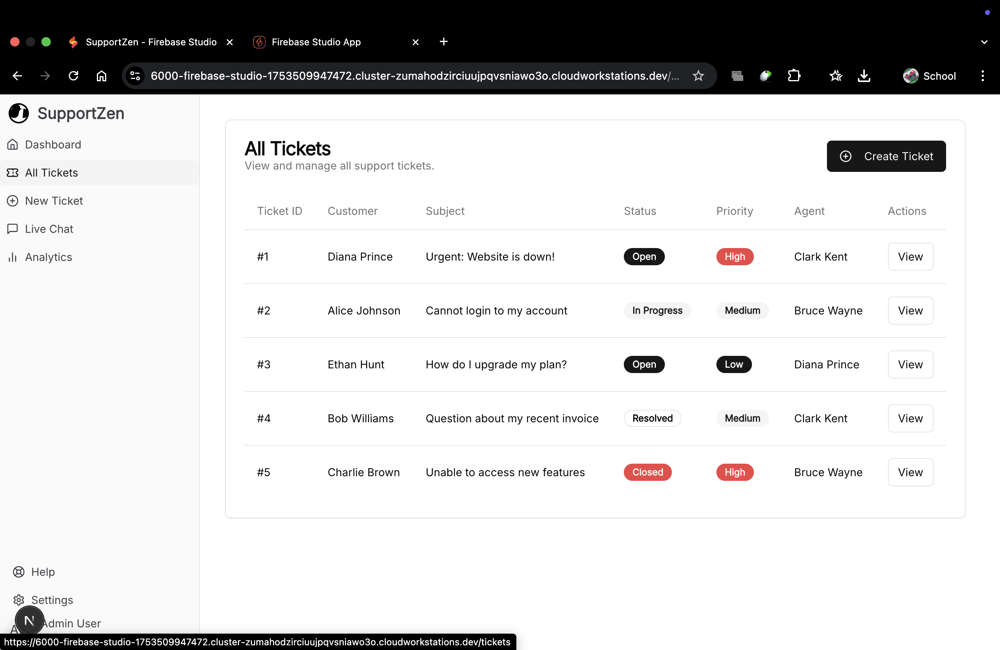
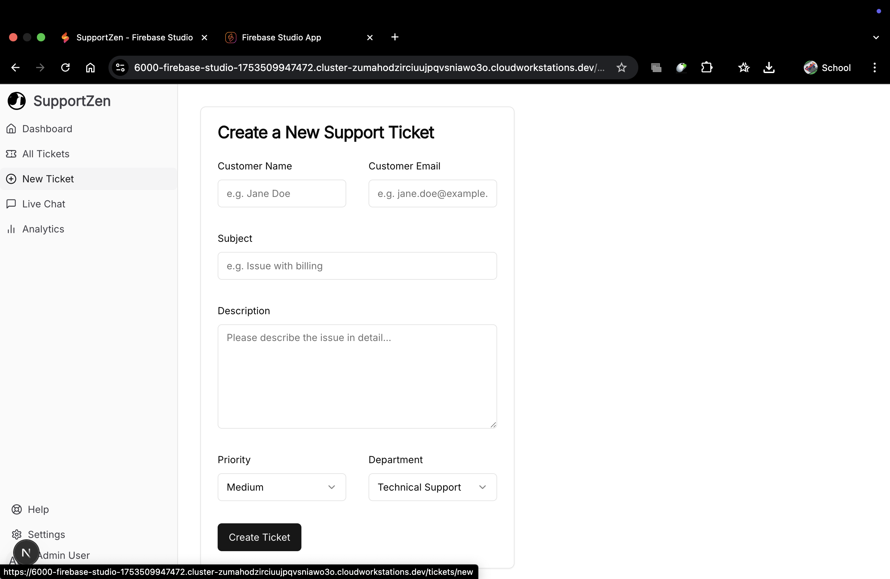
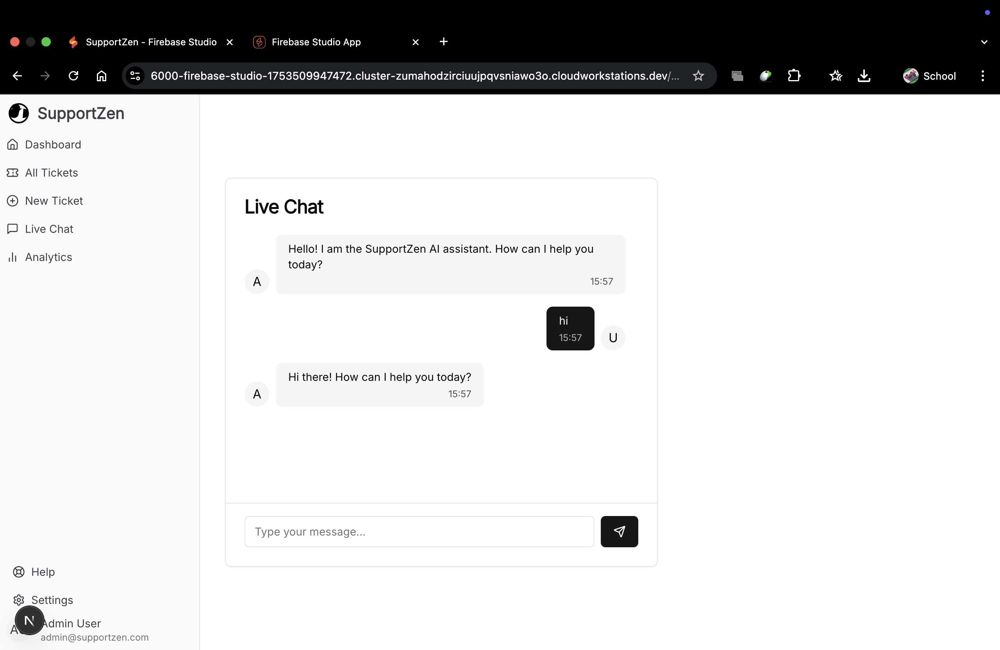
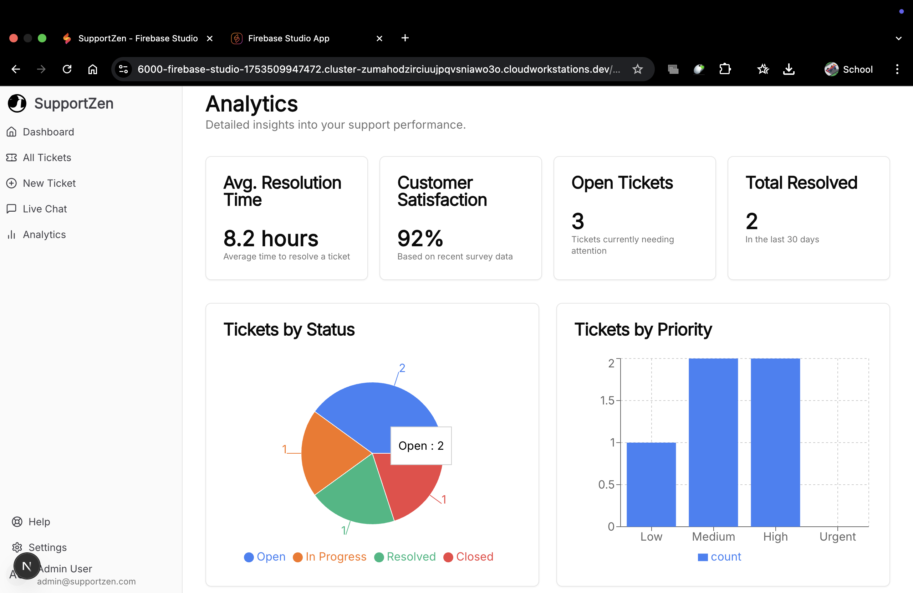
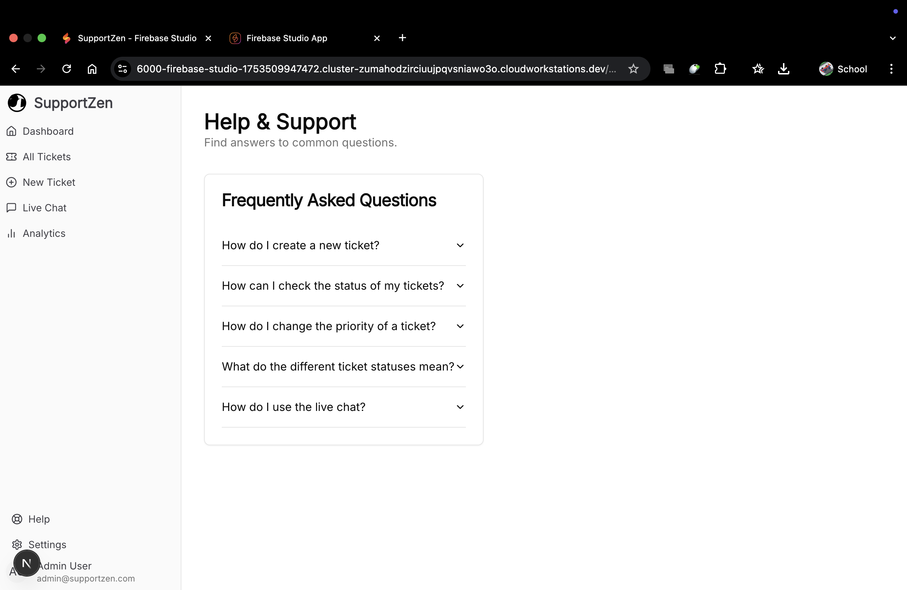
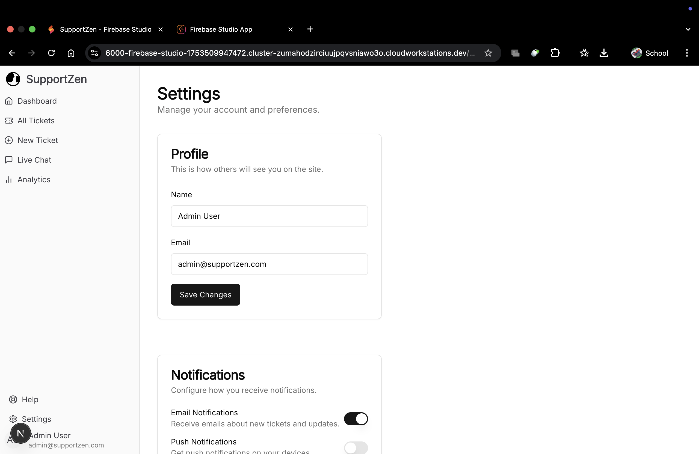

# 🤖 Customer Support Automation System

Welcome to the **Customer Support Automation System** – a smart automation tool designed to streamline customer service operations using AI and automation workflows.

## 🚀 Project Overview

This system helps businesses and support teams automate responses to common customer queries, categorize tickets, and improve resolution speed. It integrates with modern no-code/low-code tools like **n8n**, enabling seamless automation of support workflows with external services like email, chat, CRM, and databases.

## 🛠️ Features

- 🧠 AI-Powered Chat Responses using NLP (OpenAI)
- 🔄 Automated Workflows built with [n8n](https://n8n.io/)
- 📩 Email Parsing and Auto-Reply
- 🗂️ Ticket Categorization and Prioritization
- 📊 Analytics Dashboard for ticket insights (future scope)
- 🌐 Integration-ready: Gmail, Slack, Notion, Google Sheets, etc.

## 📦 Tech Stack

| Component            | Technology Used                |
|---------------------|-------------------------------|
| Automation Tool     | n8n                           |
| Backend Integration | Node.js, HTTP APIs            |
| AI/NLP Engine       | OpenAI GPT / LangChain        |
| Data Storage        | Google Sheets / Notion / MySQL (optional) |
| UI (Optional)       | HTML, CSS, JavaScript         |

<h3>🖼️ User Interface Previews</h3>

